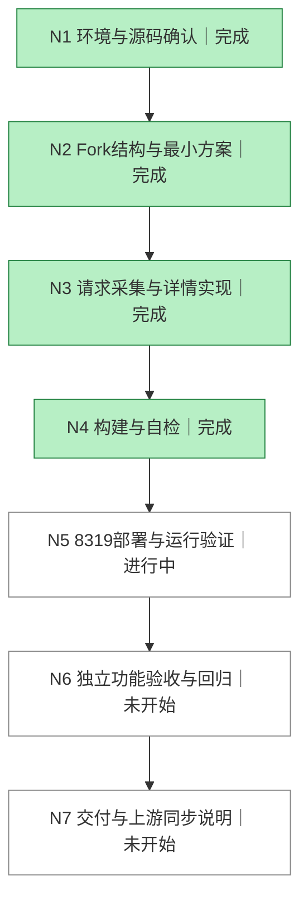

# Prompt Inspector DAG

目标：基于 Keeper Fork 提供所有已记录请求的完整原始入参和 Prompt 查看；8319 提供新界面，保留8318采集服务，上游可合并。

验收：真实 CPA 请求产生日志、Keeper请求列表能找到、8319详情显示Prompt和原始入参、复制/下载可用；失败/大日志/无日志情况正确；原有登录和统计回归；独立Agent验收。

|节点|负责人|依赖|完成标准|状态|轮次|产物/证据|
|---|---|---|---|---|---|---|
|N1|主Agent|无|确认服务、版本、仓库、规范|完成|1|8318 PID13033，Homebrew1.15.7，Willxup/cpa-usage-keeper；无适用AGENTS；原工作区未动|
|N2|主Agent|N1|建立Fork与避免队列竞争的方案|完成|1|PengZoneLab/cpa-usage-keeper；upstream保留；v1.15.8；独立Agent确认HTTP pull竞争；8319仅反代8318 API|
|N3|主Agent|N2|原始请求解析、Prompt详情、部署入口实现|完成|1|promptInspector.ts，RequestEventLogModal.tsx，cmd/prompt-viewer|
|N4|主Agent|N3|解析测试、代理测试、前端检查和构建通过|完成|2|15项前端测试、typecheck、lint、build、Go代理测试通过|
|N5|主Agent|N4|8319运行、真实CPA请求在页面可查|未开始|0|待生成|
|N6|独立Agent acceptance|N5|独立检查功能、鉴权、隔离与原有功能|未开始|0|待生成|
|N7|主Agent|N6|最终产物、版本、同步与回滚文档完整|未开始|0|待生成|

历史：见 LOOP.md。代码基线以 git rev-parse v1.15.8 为准；最终提交与验收版本在交付时记录。
