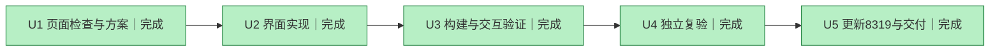

# 请求阅读器设计优化

负责人：U1/U2/U3/U5 主Agent；U4 独立Agent acceptance。基线4f22b1e7。验收：可读的角色对话、原始参数保真、日志和下载保留、桌面/窄屏与键盘可用，8319正常部署。

|节点|依赖|完成标准|轮次|证据|
|---|---|---|---|---|
|U1|无|检查运行界面与现有样式，完成设计方案|1|frontend-design Skill；现有界面已观察|
|U2|U1|实现阅读器和列表提示|1|PromptReader.tsx、局部CSS、Modal接入及文案|
|U3|U2|构建、测试、真实页面交互和窄屏检查通过|2|desktop.png、mobile.png、dark.png；15项测试、构建、lint、typecheck；原文复制JSON一致及下载成功|
|U4|U3|独立Agent确认数据保真与回归|1|ACCEPTANCE.md；92项独立测试通过|
|U5|U4|部署服务，交付源码和截图|1|8319 launchd已更新；桌面/窄屏/深色截图；本地提交交付|

设计：#243b53深蓝墨色、#087e8b青色强调、#f1f5f9蓝灰底色、#dce5ed边线、#ffffff内容纸面；暗色映射保留主题。Avenir Next用于小型产品名，系统中文字体用于对话，Menlo用于原始参数。左侧请求身份/右侧内容工作区；真正消息序列作为结构，舍弃堆叠JSON的阅读方式。保留原始日志的虚拟滚动。

历史轮次：R1旧日志默认进入无对话页，5项原有测试失败；F1缺正文默认打开原始日志，复用原有复制兼容函数；R2重新验证，不改写R1失败记录。

R3独立审查发现长内容渲染风险、null/空数组显示问题；F2复用虚拟滚动并保留字段；R4独立测试及运行截图通过。没有将失败轮次改为通过。

最终验收：主Agent完成真实浏览器三视图、复制、下载、Tab焦点、390px窄屏与深色检查；独立Agent验收见报告。8318配置、采集和后端本轮未修改。剩余阻断：无。
