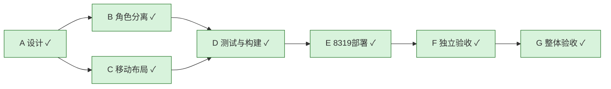

# 移动请求事件与角色分离：完成
2026-09-28；基线0d3fac59 + 本轮移动阅读器与角色分离变更；提交版本以 Git 历史为准。
最终二进制SHA256：5af4bd5e76cdc43ec563cea262647beb59af0559b402d5615887d4742d098bd0。
Bundle index-C16TBoKd.js；本机8319；390×844 Chrome响应式实测，非手机真机。

|ID|负责人|依赖|完成标准|状态|轮次|证据|
|---|---|---|---|---|---|---|
|A|主Agent|无|规范与设计核查|完成|1|DESIGN.md|
|B|roles_backend|A|真实角色解析、默认轻量|完成|2|Go race、api-verification.json|
|C|mobile_ui|A|手机阅读卡片、折叠筛选、角色区分|完成|3|roles-mobile-final.png|
|D|主Agent/独立验收|B,C|相关测试、静态检查、构建|完成|3|39 tests、ACCEPTANCE.md、build-final.txt|
|E|主Agent|D|8319运行最终产物|完成|3|上述SHA、截图Network最终bundle|
|F|mobile_review|E|独立审阅角色、截图、测试和运行证据|完成|3|ACCEPTANCE.md、raw-switch-ax.txt、refresh-ax.txt|
|G|主Agent|F|证据适用于最终交付|完成|3|全部必要关卡通过，无阻断|

历史见LOOP.md与ACCEPTANCE.md。未测Safari/手机5G真机，不属于本轮桌面响应式验收结论。

