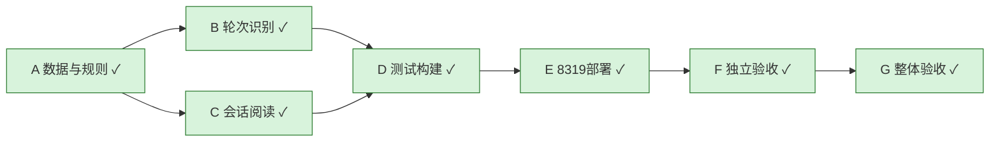

# 会话轮次阅读
目标：Session以用户提问组织模型调用，避免把每次API调用当作新提问；输入50字预览可展开，保留完整请求、角色上下文及原始日志。
基线：1c62c35f；环境：本机8319；主Agent负责集成部署，roles_backend/backend、mobile_ui/frontend、mobile_review独立验收。

|ID|依赖|完成标准|负责人|状态|轮次|证据|
|---|---|---|---|---|---|---|
|A|无|核查真实协议与判定边界|主Agent|完成|1|data-shape.json|
|B|A|保守turn key，不合并重复新提问，未知保持独立|roles_backend|完成|2|ACCEPTANCE.md|
|C|A|50字提问、最新返回、折叠调用、分页与重试|mobile_ui|完成|2|ACCEPTANCE.md|
|D|B,C|相关测试/静态检查/构建通过|主Agent|完成|2|ACCEPTANCE.md、mobile-grouped.png、api-verification.json|
|E|D|8319最终产物生效|主Agent|完成|2|ACCEPTANCE.md、mobile-grouped.png、api-verification.json|
|F|E|独立测试、真实API、手机尺寸交互与截图审阅|mobile_review|完成|2|ACCEPTANCE.md、mobile-grouped.png、api-verification.json|
|G|F|当前版本所有必要证据有效|主Agent|完成|2|ACCEPTANCE.md、mobile-grouped.png、api-verification.json|

历史见LOOP.md；手机真机不可用，使用Chrome响应式实际运行验证，明确标注边界。

最终部署binary SHA256：80660c87b4702e71c34c5963d6ca0c7115cca03005a4f0f10ba25bcff080d475；bundle index-DR32c5zQ.js。基线1c62c35f + 工作区，尚未提交推送。

